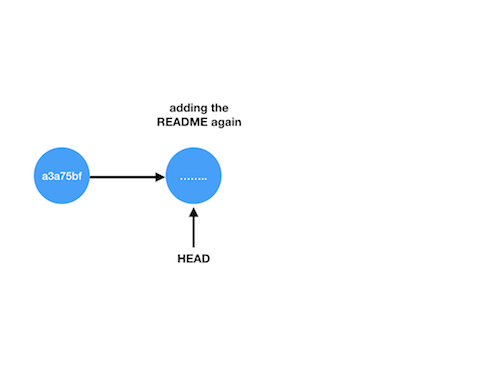

Title: Big commits in GitHub
Tags: Github
Date: 2018-09-10 13:00
Category: Github 
Summary: What do you do when you have committed a large file to GitHub?

## Undoing a large commit

Accidentally committing a large file (i.e. greater than git's limit of 100MB) is a frustrating experience. For example, let's say you made some changes to `big_file.bin`, a 200MB file, and to your README in the following way:
```bash
$ dd if=/dev/zero of=big_file.bin count=200 bs=1048576  # make 200 MB file
$ git add big_file.bin                              # we will regret this!
$ git commit -m "committed huge binary file"
[master 9cee256] committed huge binary file
$ git add README.md
$ git commit -m "... and made a small change to the README"
[master 0f1a832] ... and made small change to the README
```
Everything is fine, until we try to push to our repo:
```bash
$ git push
....
remote: error: File big_file.bin is 106.00 MB; this exceeds GitHub's file size limit of 100.00 MB
To YOUR_REPO_NAME
! [remote rejected] master -> master (pre-receive hook declined)
error: failed to push some refs to YOUR_REPO_NAME
```

## Failed attempt to fix

Here is an attempt to fix that fails:
```bash
$ git rm big_file.bin
$ git commit -m "removed big file"
[master 1eb14a7] removed big_file
$ git push
.... (still see message about failing to remove)
```

The problem is that git is trying to keep track of the history of all your commits. Git wants to push both the file *and* the fact it was deleted, so other developers can rewind the deletion. To do this, git still needs to push the large file to the remote, which it cannot do for large files.

We will look at two ways of fixing this problem:
* Rewinding master locally, and pushing a new version of master. The downside is `big_file.bin` will still take up memory on your local repo.
* Removing all mention of `big_file.bin` from your repo by rewriting your git history. The downside to this approach is that you can break git, and it cannot be done if you have untracked files.

Let's look at these two approaches. If all else fails, the third option is to make a new clone of the repo, and copy over just the files you want -- but this should be a last resort.

### Actual fix #1: keep history local

Our log of commits now looks like this on our local machine:
```bash
1eb14a7 (HEAD -> master) removed big_file
0f1a832 ... and made small change to the README
9cee256 committed huge binary file
a3a75bf commit before all this happened
....... (previous commits)
```

We want to get rid of the file originally committed in commit `9cee256`. To do this:
1. First, reset back to that commit:
```bash
$ git reset 9cee256~1 # go back one more than the troublesome commit
```
This is a _soft_ reset, so your files will stay the same on your local machine.
2. (Optional) If you haven't done so already, you can delete `big_file.bin`.
3. Then add the README back to the repo, and commit it
```bash
$ git add README.md
$ git commit -m "adding the README again"
```
4. Finally push the new commit back up.
```bash
$ git push origin master
```

In this approach, the local git history still has the "bad" commits in it

They are off the main "master" track, but they will still remain on your disk. The commit you pushed up doesn't have the commits in the red box in its history, so the remote repo will look like this:


### Actual Fix 2: rewrite history with `filter-branch`

This one will only work if you don't have unstaged work in your repo. It also means rewriting the history, so there is the potential to mess things up!

With those warnings in mind, you can run
```bash
git filter-branch -f --tree-filter 'rm  big_file.bin' 9cee256..HEAD
```
This will remove `big_file.bin` from every commit from `9cee256` to `1eb14a7` (the current HEAD).

You should then be able to push to your repository with
```bash
git push
```
