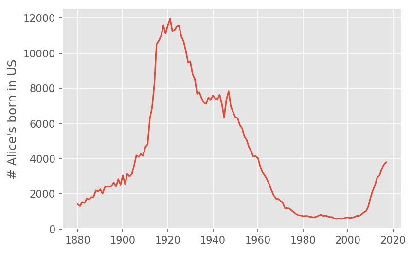

Title: Name to Age
Tags: Data Analysis, Naive Bayes
Date: 2018-10-01 17:00
Category: Pandas 
Summary: How much does your name say about your age? We use the database of names from the social security administration, as well as age distribution data from the US Census, to find out! See what your own name's age distribution looks like [here](https://kiwidamien.github.io/names_app/).

Names go in and out of fashion; by knowing someone's name you can get some idea of how old they are. For example, if you were meeting someone called Gertrude or Wilma, you would probably assume that they were reasonable old (the median age of a living Gertrude in 2017 is 80, while the median age of a living Wilma is 75). Other names have only recently come into fashion; for example Zoe is a relatively young name with a median age of 11.

There can be interesting cultural stories for why names go in an out of fashion. Take my name, Damien, as an example. The social security administration publishes the number of children born with a given name for each year. Here is the graph for number of Damien's born in the US per year:


We can see "Damien" went from being a relatively obscure name before 1970, and then started increasing in popularity until the 1980s, when it underwent a steep decline. I am reasonably sure I know the culprit:


_The Omen_ is a series of films, spanning from 1976 - 1981, about the Antichrist being born as a small child, destined to bring about the end of the world. The name of our demonic baby is, as you may have guessed, Damien. The amusing thing about this graph is that immediately after the release of the first film, the name Damien actually _increased_ in popularity, but declines sharply once the series ends. We can now see a resurgence in the name, although we should be careful to normalize for the growing population. Still, from this graph it seems clear that if all we knew about someone is that his name was "Damien", we would expect him to be born around 2009 (i.e. approximately 8 years old).

A named that surprised me as being an "old" name was Alice. One of my colleagues at Metis, [Alice Zhao](http://adashofdata.com/), was telling me that there were very few Alice's in her classes growing up. The social security naming data backed her up on this:


In this case, would we really expect a randomly selected Alice to by born in 1920 (i.e. almost 100 years old)? Probably not. We see that around 2004 the name Alice started rising in popularity again, and many of the Alice's from the 1920s wouldn't be alive today.

## Our goal

Our goal is to quantify the amount of information a name and gender give you about someone's age. Specifically, for each name and gender combination of someone who is still alive, we will get a probability distribution for the age. Mathematically, we are after the conditional probability
$$P(\text{age} | \text{living, name, and gender})$$

### Why is this interesting?

- While it doesn't have great practical importance, it is a fun and easy to understand application of Baye's theorem and the Naive Bayes assumptions.
- While `sklearn` has methods for doing Naive Bayes, it turns out to be impractical to use for this problem (more about this in [this section](#hard-on-sklearn)). This is a nice problem that shows how knowing an algorithm can save significant computational resources.

The data sets we will use for solving this problem are:

* The US census [age distribution](https://factfinder.census.gov/faces/tableservices/jsf/pages/productview.xhtml?src=bkmk). This will tell us `P(Age=a)`, the probability that a randomly selected (living) person is `a` years old.
* The Social Security [baby name database](https://catalog.data.gov/dataset/baby-names-from-social-security-card-applications-national-level-data). This will tell us the number of baby's per year with a given name and gender. This can get us `P(Name=n, gender=g | year of birth=y)`.

Let's pretend for a moment that if I know `P(Name=n, gender=g | year of birth=y)` then I know `P(Name=n, gender=g | age=a)`, using the simple heuristic `a = 2018 - y`. Then we can use Bayes's theorem to get the probability that we are interested in:
$$P((\text{age} | \text{name, and gender}) \propto P(\text{Name=n} | \text{age=a and gender=g})\,P(\text{age=a and gender=g})$$

This is ultimately the answer we are going to use. The tricky part about this project is getting the data into a suitable format. I won't cover the cleaning here, but you are welcome to look at the [github repo](https://github.com/kiwidamien/naive_bayes_names/) where this is done. The end product of all the cleaning is to produce the graphs used in this blog post, and a nicely formatted JSON file with the probabilistic information in it.

This JSON file is used by a separate [application](https://kiwidamien.github.io/names_app/), which allows you to select the names you are interested in without downloading the data or running any notebook code.

### The problematic link between age and year of birth

Because people die, we cannot say that all people born in year `y` will be an age of `2017-y`. If the rate people die is independent of their name and gender, then we could still assume that
```
P(Name=n |gender=g and year of birth=y) = P(Name=n | gender=g and age=2017 - y)
```
even taking death into account.

Unfortunately it is unlikely that the probability that someone lives to a certain age is independent of name and gender. We certainly know that women have a longer lifespan than men, but this could easily be accounted for by using the demographic distribution for each gender. More subtly, names are not evenly distributed amongst ethnicity or socioeconomic classes.

We also get the age distribution from census data. This data represents people in the US, including immigrants, while excluding those born in the US that have emigrated. The social security name database only includes people born in the United States. We should be a little skeptical when reviewing this model's answers for names that belong primarily to people that immigrate to the US, rather than people that were born here.

This is the "naive" part of our Naive Bayes approach. When making a data science model, some simplifications of reality are inevitable, but it is good to know where they are.

## The demographic data

Let's have a look at the age distribution in the US:


We can see that the distribution is relatively flat to age 60, with a little bit of a bump around 25. It could be an indication of people immigrating to the US after getting their first degree. We don't see a sharp decline until age 60.

Roughly, this means when looking at birth charts like the ones we have seen for "Damien" and "Alice", we can expect the plots to be reasonably representative of living people as far back as 1960. When we start going further back than that, the rate at which people survive starts to have a big impact on the typical age of a person we meet.

## Basic approach

Instead of using the builtin sklearn Naive Bayes methods, we constructed the probabilities by hand. The complete notebook processing the data can be found in [this repository](https://github.com/kiwidamien/naive_bayes_names/), but here are the main steps:

1. First we group by each `gender`, and `birth_year` combination, calculating the percentage of people with each name. This gives us `P(name | gender and birth_year)`
2. Then we find `P(age)` from the demographic data. We assume that `P(age and gender) = P(age)`, although we could do a better job here.
3. We calculate the numerator from Bayes's theorem: `P(name | gender and birth_year)P(age)`, where we join rows where `age = 2017 - birth_year`.
4. Then we find the normalizing factor by summing all rows with the same name to give us the probabilities.
5. Finally, we make a cumulative probability, so that we can find the quartiles.

I also made the choice to exclude names and gender combinations that occurred fewer than 5000 times. This is because the social security names seemed quite dirty; for example according to the data there are 280 women named "Damien" between 1880 and today, which I found unlikely. Some other oddities: there are 2132 male "Amanda"s, 1493 male "Alice"s, and 1545 female "Fred"s.

Because of this crude way of dropping data without sufficient support, I did not feel I needed to include [Laplace smoothing](https://en.wikipedia.org/wiki/Additive_smoothing), a technique used in Naive Bayes for adding "fake counts" to data to ensure rare events don't get assigned a probability of zero.

## Some examples

With all the pre-word behind us, let's see what the distribution of ages of people named Alice is

From the distribution, we can find that the median age of Alice is 67 years old (the lower and upper quartiles are 51 and 78 years, respectively).

We saw above that the name Damien hasn't been popular for very long; as expected the distribution of ages is almost the reflection of the distribution of years born:


There are some other interesting patterns in this data. For example, some names like "Lindsey" have changed from being a predominately male name, to a predominately female name. It is interesting to look at both genders on the same plot:


For women, we see that there are almost no women older than 42 named Lindsey. There are a significant proportion of men named Lindsey that are older than 60, but it might surprise us not to see a very sharp cutoff. One of the drawbacks of this graph is that we don't get relative sizes of the data sets; the number of women named Lindsey is 155788, compared to only 7030 for men. The reason that this graph doesn't include the raw numbers is because our question was "given a name and a gender, determine the likelihood of each age". The raw numbers would help us answer a different question, namely how likely it would be to encounter someone with that name and gender.

<p id='hard-on-sklearn'></p>
## Hard on sklearn

One of the interesting things about this dataset is that sklearn has a builtin Naive Bayes classifier, yet in this case it is easier to write Naive Bayes from scratch. To see why, let's start with a very limited population with only two distinct names, and 3 distinct ages

| name | gender | count | age |
| --- | --- | --- | --- |
| Alice | F | 500 | 30 |
| Alice | F | 500 | 25 |
| Alice | F | 500 | 20 |
| Sam | F | 1000 | 30 |
| Sam | F | 500 | 25 |
| Sam | M | 500 | 30 |
| Sam | M | 1000 | 25 |

If we wanted the age distribution of men named Sam in this population, we would predict an age of 30 with probability of 500/1500 (i.e. 1/3), and an age of 25 with probability of 1000/1500 (i.e. 2/3).

In terms of an sklearn approach, the features ("inputs") are the name and gender, and we want to predict the probability of the age column. The `count` column tells us how many identical rows we have in the data. So a literal interpretation would mean repeating the columns:
```python
from sklearn.naive_bayes import BernoulliNB
import numpy as np

nb = BernoulliNB(alpha=1e-5) # make Laplace smoothing parameter small
name_vectorizer = {'Alice': 0, 'Sam': 1}
gender_vectorizer = {'F': 0, 'M': 1}

X = np.array([[0, 0]]*1500 + [[1, 0]]*1500 + [[1, 1]]*1500)
y = [30]*500 + [25]*500 + [20]*500 + [30]*1000 + [25]*500 + [30]*500 + [25]*1000
nb.fit(X,y)
```
We can get the prediction with the following method:
```python
nb.predict_proba([[name_vectorizer['Sam'], gender_vectorizer['M']]])
# returns [0, 0.666, 0.333]
```
i.e. there is no chance of the smallest age (20), and the probability of ages 25 and 30 are 0.666 and 0.333 respectively. Note that in order to do this calculation, we went from 7 "binned" rows to 4500 rows (one for each individual person).

For our actual dataset, this would be a huge problem. Our binned data (i.e. unique name, gender combinations) has 3793 records. The number of individual people represented by 29 **BILLION** rows! Even with sklearn's support for partial fitting, this is an enormous number of rows!

There should probably be a way for sklearn's Naive Bayes implementation to deal with binned data, but even without it a little bit of math can allow us to make predictions while reducing the dataset by a factor of 7 million!

## Related work

Once I started this project, I came across Nate Silver's similar analysis, ["How to tell someone' s age when all you know is her name"](https://fivethirtyeight.com/features/how-to-tell-someones-age-when-all-you-know-is-her-name/). The idea to find the quartiles for the different ages, which is incorporated into the [web application](https://kiwidamien.github.io/names_app/), came from his article.
