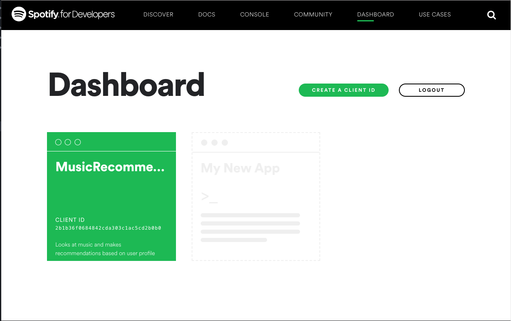

Title: Getting data with OAuth
Tags: Data mining, OAuth, API
Date: 2018-10-14 11:00
Category: Web
Summary: An example of using OAuth2.0 to access an API using Python's requests module, using Spotify as an example.

You have found a great data source, with a published API. This means that you don't have to scrape pages, and do messy error prone parsing of HTML. Only one problem: you need to authenticate your script in order to use the API! Furthermore, the documentation gives you a list of endpoints you can query, such as
```python
GET /list_of_current_movies/{zipcode}/
```
but it isn't always clear how to pass along the authentication information.

## The old way

In some sites, you simply have to make a POST request with a couple of keys. Usually these are a username and password, or a client id and a client secret. A request might look like this:
```python
params = {
  'client_id': 12345,
  'client_secret': 'AFASGou1821945u82109570912412098'
}

r = requests.get('http://api.myawesomesite.com/list_of_current_movies/98144/', params)

information = r.json()
```
The `client_id` is typically used to track who is making calls to the API (so that you can be limited to the number of calls you are paying for), and the `client_secret` acts like a password.

Passing this information in every request isn't that secure, so more and more sites are using OAuth2, which requires tokens.

## Overview of the OAuth2.0 process

We are going to focus on _two-legged authentication_, in which you register an application with the site, and then use the application to collect data. This is two-legged because there are two parties involved: the site, and your application.

If your app wants to access private user data, you generally need the user to agree to give you app permission, which is what happens with _three-legged_ authentication, because we need to identify the user, the site, and the application. If you have ever used a Facebook app that asks for permission to use certain types of data from your profile, you have participated in three-legged authentication.

Application developers will probably want to focus on three-legged authentication. As data scientists, we are probably happy grabbing the publicly available data (that is, until we want to make personalized recommendations and predictions), so we will focus on the simpler two-legged authentication.

The basic process for getting setup for OAuth2 is to register an application, to get an `id` and a `secret`. To actually use the `id` and `secret` is a little more involved:

1. First, we use the `id` and `secret` to get a _token_ from the authorization endpoint.
2. Then we can use the token from step 1 in future requests to authorize us.

The token generated in step 1 is similar to the old method of passing your `id` and `secret` each time, except that tokens expire. If someone gets hold of your token, then they can access the API as your app until the token expires (tokens are typically valid for about an hour on most sites). If they access your `id` and `secret`, then they can pretend to be your app forever.

The rest of this post will show how to authenticate your requests for the Spotify API. From here, you should be able to generalize to other APIs with small changes. For the impatient, a simple version of the code has been posted [here](https://gist.github.com/kiwidamien/f1f310f81c48c57a531b8464b877bf9c), as well as a slightly more robust [class-based version](https://gist.github.com/kiwidamien/09bb2d4a55c9fb3b265697ba12c1ff8e).

## Spotify API

The [Spotify API documentation](https://developer.spotify.com/documentation/web-api/reference/tracks/) shows a list of endpoints we can use. We are going to try and access the following endpoint:
```python
GET /v1/tracks/{id}
```
This endpoint will tell us a lot of information about where the track labeled by `id` is played, the duration, and the artists. An [example from the documentation](https://developer.spotify.com/documentation/web-api/reference/tracks/get-track/) is gives the curl request, and the output for the track `11dFghVXANMlKmJXsNCbNl`:
```bash
 curl -X GET "https://api.spotify.com/v1/tracks/11dFghVXANMlKmJXsNCbNl" -H "Authorization: Bearer {your access token}"
```

The (truncated) output is

```python
 {
  "album": {
    "album_type": "single",
    "artists": [
      {
        "external_urls": {
          "spotify": "https://open.spotify.com/artist/6sFIWsNpZYqfjUpaCgueju"
        },
        "href": "https://api.spotify.com/v1/artists/6sFIWsNpZYqfjUpaCgueju",
        "id": "6sFIWsNpZYqfjUpaCgueju",
        "name": "Carly Rae Jepsen",
        "type": "artist",
        "uri": "spotify:artist:6sFIWsNpZYqfjUpaCgueju"
      }
    ],
    "available_markets": [ ....],
    ....
  }
}
```

Our goals are to be able to create the access token so we can make this request, and then make the request in Python rather than using cURL.

### Setting up an app

The first thing we need to do is create an application on Spotify's website, so that Spotify can track and limit our API usage. To do this:

1. Go to the Spotify developer page https://developer.spotify.com/
2. Log in (or create an account if necessary)
3. Click on 'dashboard' (or go to https://developer.spotify.com/dashboard/applications)
4. Click on 'Create a client id' on the upper right-hand side



You will have to fill in a little bit about your application, and then you will get redirected to your application page. This page will give you access to your client id, and you will be able to click "SHOW CLIENT SECRET" to see your client secret.


Copy the client id and client secret into your script.

### Getting a token

For Spotify, we get tokens by passing our client id and secret to https://accounts.spotify.com/api/token. Each service using OAuth will have a similar location to get tokens.

We will have to explain how to encode the client id and secret, but the basic structure of the token request is
```python
import requests
import base64

#.....
# Some code here to make base64_encoded_id_secret
#

headers = {
  'Content-Type': 'application/x-www-form-urlencoded',
  'Authorization': 'Basic {}'.format(base64_encoded_id_secret)
}

params = {'grant_type': 'client_credentials'}

r = requests.post('https://accounts.spotify.com/api/token', headers=headers, params=params)

token = r.json()['access_token']
```

The header object is telling us how the request is encoded (using `application/x-www-form-urlencoded` is standard for OAuth requests), and passing in the client id and secret. This part is transferrable to other applications. Spotify also requires we tell it what sort of token we want using the custom `grant_type` in the `params`.  This generally won't be the same in different applications (you will need to check the documentation for the service you are using to see what, if anything, it requires).

The request object returns a few more fields:
```python
{'access_token': 'BQBOBniuRmoc1tZzTCV4PWidAgSf2JufLwR4YdzQ8Dbiu0XmSeNvxNfUY9U_b_ZItrXKbsXpZVj5bzssOBE',
 'expires_in': 3600,
 'scope': '',
 'token_type': 'Bearer'}
```

The one we are interested in is the `access_token`. The `expires_in` tells us how many seconds this access token is valid for, which in this case translates to 1 hour. Any requests we want to make after that will require we get a new token and use that instead.

Now we need to encode the id and secret so the above code will run!

### Base64 encoding

To keep this example concrete, let's say:

* my `client_id` is `12345`
* my `client_secret` is `8ACDC`

To get my token, I need the `Authorization` field of the header to be the string `12345:8ACDC` after _base64 encoding_.

Python3 makes this a little cumbersome, because it treats base64 as `bytes`, which are distinct from strings. Let's show the answer, and then talk about what is happening at each step:
```python
# get the base64 encoded STRING for '12345:8ACDC'
base64_encoded_id_secret = base64.b64encode('12345:8ACDC'.encode()).decode()
```

Here are the steps:

1. We start with the string we want to encode: `'12345:8ACDC'`
2. We need to convert it to bytes, because Python3 won't allow base64 encoding on strings. The `encode()` method turns a string into bytes. Note this is usually pretty boring, as `'random string'.encode()` will return `b'random string'` in the Python interpreter, where the `b` at the front is telling us Python is now thinking of this object as bytes rather than a string.
3. Then we do the base64 encoding. Here `base64.b64encode('12345:8ACDC'.encode())` returns a `b'MTIzNDU6OEFDREM='`.
4. We still need to do string operations to this, because we end up passing `Basic MTIzNDU6OEFDREM=` to the `Authorization` field. To convert from bytes back to a string, we use `decode()`.

### Final code to get token

Here is all the code to get the token:
```python
import requests
import base64

client_id = '12345'      # replace with your_client_id
client_secret = '8ACDC'  # replace with your_client_secret
to_encode = client_id + ':' + client_secret
base64_encoded_id_secret = base64.b64encode(to_encode.encode()).decode()

headers = {
  'Content-Type': 'application/x-www-form-urlencoded',
  'Authorization': 'Basic {}'.format(base64_encoded_id_secret)
}

params = {'grant_type': 'client_credentials'}

r = requests.post('https://accounts.spotify.com/api/token', headers=headers, params=params)

token = r.json()['access_token']
```

## Using the token

Recall our goal was to query the endpoint `v1/tracks/11dFghVXANMlKmJXsNCbNl` to get information track `11dFghVXANMlKmJXsNCbNl`. We already saw the cURL request that could do this:
```bash
 curl -X GET "https://api.spotify.com/v1/tracks/11dFghVXANMlKmJXsNCbNl" -H "Authorization: Bearer {your access token}"
```

If we copied-and-pasted in the token we got above for the access token, the request would work. Let's see how we can get it to work in Python:

```python
# we have token from before
header = {'Authorization': 'Bearer ' + token }

r = requests.get('https://api.spotify.com/v1/tracks/11dFghVXANMlKmJXsNCbNl', headers=header)

result = r.json()
```

Notice a few things here:

* We didn't have to put the content type into the header
* We pass the token directly; **DON'T** try and do any base64 encoding on it
* The Authorization type has changed from `Basic` (using the base64 encoded `'client:secret'`) to `Bearer` (using the token directly)

## Summary

Using two-legged OAuth requires three steps:

1. Register an app, to get client id and secret
2. Find out the URL to get tokens, and make a POST request to generate tokens. In the case of Spotify, this is https://accounts.spotify.com/api/token. Requires a base64 encoding of the `id:secret` string.
3. Make all future requests with the header `{'Authorization': 'Bearer <the token>'}`.

There is an [example of the full source](https://gist.github.com/kiwidamien/f1f310f81c48c57a531b8464b877bf9c) for this application. A slightly more [sophisticated example](https://gist.github.com/kiwidamien/09bb2d4a55c9fb3b265697ba12c1ff8e) refreshes the token once it expires, which can be useful when you have long running scraping jobs.
