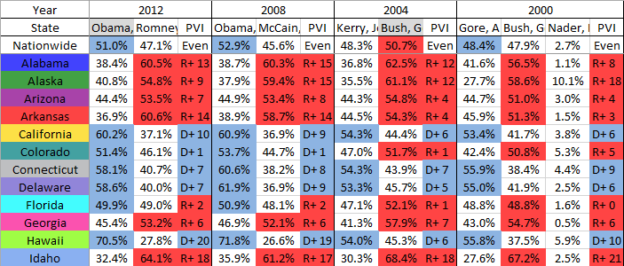

Title: Munging with MultiIndices: election data
Tags: Data munging, Pandas
Date: 2018-09-27 11:00
Category: Pandas 
Summary: We show how to take an Excel spreadsheet, with merged column headings, and process it for further analysis.

There is lots of data available for the [2016](https://data.opendatasoft.com/explore/dataset/usa-2016-presidential-election-by-county@public/) and [2012 presidential](https://www.kaggle.com/joelwilson/2012-2016-presidential-elections) elections, broken down to the county level.

The other election years can typically be found in the form of PDFs, and have to be manually converted. Finding a comprehensive list of election results for multiple years is challenging. Stephen Wolf of the Daily Kos has created an [Excel spreadsheet](https://drive.google.com/folderview?id=0Bz_uFI8VY7xLekx0cWdVcGhJblk&usp=sharing) from [Dave Leip's Atlas](http://uselectionatlas.org/), which gives the election results back as far as 1828.

The trouble is, the Excel sheet is difficult to import into Pandas.



Note the data is _wide_, with a multiple headers. The `Year` spans multiple columns, which is then broken down by candidate. Also note that some years have two candidates, while other years have three or more.

The data shown in the screenshot are shown by percentages of the vote. If we scroll across to column **HG**, the votes are reported again in raw numbers.

Our goal is to read the data into the following format:
```
year,state,votes,candidate,party,short_state
2016,Alabama,729547,"Clinton, Hillary",Democratic,AL
2016,Alaska,116454,"Clinton, Hillary",Democratic,AK
2016,Arizona,1161167,"Clinton, Hillary",Democratic,AZ
2016,Arkansas,380494,"Clinton, Hillary",Democratic,AR
2016,California,8753788,"Clinton, Hillary",Democratic,CA
2016,Colorado,1338870,"Clinton, Hillary",Democratic,CO
2016,Connecticut,897572,"Clinton, Hillary",Democratic,CT
```

In this post we will walk through the main steps, but a repository including the full code for processing this data set is available [here](https://github.com/kiwidamien/presidential_election_data).

## Dealing with a MultiIndex

Let's start with a simplified excel spreadsheet with the following format:

<table>
<tr>
  <th>Year</th>
  <th colspan=3 style="text-align:center">2012</th>
  <th colspan=3 style="text-align:center">2008</th>
</tr>
<tr>
  <td><b>State</b></td>
  <td>Total</td>
  <td>Obama, Barak -  Democratic</td>
  <td>Romney, Mitt - Republican </td>
  <td>Total</td>
  <td>Obama, Barak -  Democratic</td>
  <td>McCain, John - Republican </td>
</tr>
<tr>
  <td><b>Alabama</b></td>
  <td>2074338</td>
  <td>795696</td>
  <td>1255925</td>
  <td>2099819</td>
  <td>813479</td>
  <td>1266546</td>
</tr>
<tr>
  <td><b>Alaska</b></td>
  <td>300495</td>
  <td>122640</td>
  <td>164676</td>
  <td>326197</td>
  <td>123594</td>
  <td>193841</td>
</tr>
</table>


Note that the sum of the "major" candidates don't sum to the totals. Presumably there are some write-ins that are not counted.

We have also skipped the percentages that occurred at the beginning of the real spreadsheet. Our goal here is to be able to unpack the multiindex.

Let's start by reading in the dataset. We don't try and name the headers.
```python
import pandas as pd

df = pd.read_excel(filename, header=None)
```
Our dataframe now looks like

| Year | 2012  | NaN | NaN | 2008 | NaN | NaN |
| --- | --- | --- | --- | --- | --- | --- |
| State | Total |  Obama, Barak -  Democratic | Romney, Mitt - Republican | Total |	Obama, Barack - Democratic |	McCain, John - Republican |
|Alabama |  2074338 | 795696	| 1255925 | 2099819 | 813479 | 1266546 |
|Alaska | 300495 |	122640 | 164676 |326197 |	123594 | 	193841 |

The merged cells have been split, and the year only appears in the first one. The other cells have been replaced by NaNs.

Now let's make a MultiIndex using the first two rows (year and candidate). Let's start by replacing the NAs using `ffill` (foward fill). This moves the last non-null value "forward" over null values:
```python
multi_index_values = df.ffill(axis=1).values[:2, 1:]
```
Note that when we only kept the first couple of columsn, and dropped the first row. Now `multi_index_values` is

| 2012  | 2012 | 2012 | 2008 | 2008 | 2008 |
| --- | --- | --- | --- | --- | --- |
| Total |  Obama, Barak -  Democratic | Romney, Mitt - Republican | Total |	Obama, Barack - Democratic |	McCain, John - Republican |

Let's make a multi-index, and make a dataframe out of it. Recall the first two rows included the headers, so we are copying the index from row 2 down. We are making the state (i.e. column 0) the row index.
```python
multi_index = pd.MultiIndex.from_arrays(multi_index_values, names=['year', 'CANDIDATES'])
multi_df = pd.DataFrame(df.values[2:, 1:], index=df.values[2:, 0], columns=multi_index)
```
Now our dataframe in pandas is almost in the same layout as the original worksheet.

<table>
<tr>
  <th>Year</th>
  <th colspan=3 style="text-align:center">2012</th>
  <th colspan=3 style="text-align:center">2008</th>
</tr>
<tr>
  <td><b>CANDIDATES</b></td>
  <td>Total</td>
  <td>Obama, Barak -  Democratic</td>
  <td>Romney, Mitt - Republican </td>
  <td>Total</td>
  <td>Obama, Barak -  Democratic</td>
  <td>McCain, John - Republican </td>
</tr>
<tr>
  <td><b>Alabama</b></td>
  <td>2074338</td>
  <td>795696</td>
  <td>1255925</td>
  <td>2099819</td>
  <td>813479</td>
  <td>1266546</td>
</tr>
<tr>
  <td><b>Alaska</b></td>
  <td>300495</td>
  <td>122640</td>
  <td>164676</td>
  <td>326197</td>
  <td>123594</td>
  <td>193841</td>
</tr>
</table>

## Unstacking

We have the problem that our columns are actually names of variables. At the top level of the column index, we have the years. At the lower level, we have the candidates. We can undo this with the `unstack` command:
```python
unstacked_df = multi_df.unstack()
```
Here `unstacked_df` has the form

```
2012  Obama, Barack - Democratic  Alabama     795696
                                  Alaska     122640
      Romney, Mitt - Republican   Alabama    1255925
                                  Alaska     164676
2008  Obama, Barack - Democratic  Alabama    813479
                                  Alaska     123594
      McCain, John - Republican   Alabama    1266546
                                  Alaska     193841
```

Calling `unstacked_df.reset_index()` fills out the columns:
```
year      CANDIDATES               level_2      0
2012  Obama, Barack - Democratic   Alabama   795696
2012  Obama, Barack - Democratic   Alaska    122640
2012  Romney, Mitt - Republican    Alabama  1255925
2012  Romney, Mitt - Republican    Alaska    164676
2008  Obama, Barack - Democratic   Alabama   813479
2008  Obama, Barack - Democratic   Alaska    123594
2008  McCain, John - Republican    Alabama  1266546
2008  McCain, John - Republican    Alaska    193841
```

We can separate the candidate and party information with the following lines:
```python
unstacked_df['candidate'] = unstacked_df.CANDIDATES.str.split('-').str[0].str.strip()
unstacked_df['party'] = unstacked_df.CANDIDATES.str.split('-').str[1].str.strip()
unstacked_df.drop('CANDIDATES', axis=1, inplace=True)
```

## The final product

Once we have this, a rename on the columns `level_2` and `0` give us
```
   year  state      votes    candidate      party
0  2012  Alabama   795696  Obama, Barack  Democratic
1  2012   Alaska   122640  Obama, Barack  Democratic
2  2012  Alabama  1255925   Romney, Mitt  Republican
3  2012   Alaska   164676   Romney, Mitt  Republican
4  2008  Alabama   813479  Obama, Barack  Democratic
5  2008   Alaska   123594  Obama, Barack  Democratic
6  2008  Alabama  1266546   McCain, John  Republican
7  2008   Alaska   193841   McCain, John  Republican
```
This is a simplified process. We didn't show the join to create the "short state code", or show how to skip the columns in the spreadsheet that contain the percentages.  A complete description of the process can be found in [this github repo](https://github.com/kiwidamien/presidential_election_data). If you are just interested in the results, you can find them in [this gist](https://gist.github.com/kiwidamien/6b069a63fa204cd7d2b893510e2efe7c) instead.
